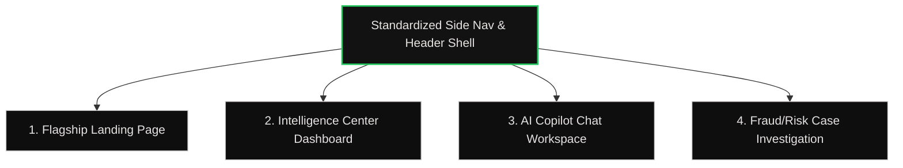

# Stitch Gap Analysis — TrustShield AI

This document provides a comprehensive gap analysis comparing the finalized designs in the connected **Google Stitch Project (ID: 5229376120522838452)** against the active repository codebase.

---

## 1. Shared Design System & Visual Grammar

The Stitch project defines a premium visual language called **"Intelligence in Motion."** It moves away from standard dark-blue SaaS layouts to an engineering-grade minimalist look with vibrant signal states.

| Token / Asset | Stitch Project Final Specification | Existing Repository State | Gap / Action Needed |
| :--- | :--- | :--- | :--- |
| **Color Base** | Deep Obsidian: `#050505` (base), `#121212`/`#131314` (cards), `#0e0e0f` (lowest depth). | Dark-Blue: `#080d19` (base), `#0d1424` (cards), `#111827`/`#1a2540` (borders). | **Major Mismatch**: Background and card surfaces must be shifted to true obsidian-black. |
| **Signal Colors** | **Living Green** (`#22C55E` / `#4be277`), **Amber Pulse** (`#F59E0B` / `#ffb95f`), **Coral Flare** (`#F43F5E` / `#ffb4ab`). | Standard blue accents (`#3b82f6`) and red alerts. | **Major Mismatch**: Realign all status colors to the desaturated functional tri-color signal system. |
| **Typography** | Headlines & Numbers: `Hanken Grotesk` (number-forward). Body: `Inter`. Tech/Thought Logs: `JetBrains Mono`. | Default Inter/system fonts. | **Mismatch**: Load and apply Hanken Grotesk and JetBrains Mono fonts; style numeric elements using Hanken Grotesk. |
| **Connection Motif** | **Signal Network**: 1px gradient paths with animated pulses of light traveling along them. | Standard border lines. | **Missing**: Implement CSS animated pulse flows along connective layout nodes. |

---

## 2. Page & Layout Hierarchy Analysis

The Stitch project defines an enterprise layout containing **4 core screens** wrapped in a standardized responsive navigation shell.

### Gap Details by Screen

#### 1. Navigation Shell & Sidebar
* **Stitch Design**: Standardized collapsible sidebar (`w-16` on desktop, expanding to `w-64` on hover) with links: *Intelligence Center*, *Customer Intelligence*, *Fraud Investigation*, *AI Copilot*, *Reports*, *Platform Architecture*, and *Settings*. Features a top app bar with global search, "AI Live" pulsing status badge, notification bell, and user profile slot.
* **Existing Code**: No side nav. Has a very basic top navigation bar (`TopNav.tsx`) with generic headers.
* **Gap**: **Complete redesign required**. Reconstruct the layout using a layout wrapper that mounts this collapsible sidebar and header shell globally.

#### 2. Flagship Landing Page
* **Stitch Design**: Full marketing hero page with a WebGL shader canvas background (`#shader-canvas-ANIMATION_23`) generating interactive glowing signal paths and aurora flares, capability details cards with left border colors, process timeline, interactive mock terminal (with command output simulations), and CTAs to "Enter Terminal" or "Launch Platform."
* **Existing Code**: **Completely missing**. The app loads directly into the simulation form.
* **Gap**: **Create from scratch** as `LandingPage.tsx` and map as the root route.

#### 3. Intelligence Center (Dashboard)
* **Stitch Design**: Operations center showing Sarah's overview briefing.
  - *Today's AI Briefing Bento Grid*: Cards for `Velocity Alert` (green border) and `Network Discovery` (amber border).
  - *Live Activity Feed*: Timeline listing SWIFT screening and Portfolio Risk-Adjustment events.
  - *High Priority Cases Panel*: Dedicated cards for Rajesh Kumar (`#990124-RT`, Trust Score `42`), including key risk triggers and AI recommendation holds.
  - *Floating command bar* at the bottom center.
* **Existing Code**: Standard dashboard that puts the transaction input form in the center of the screen, with no bento briefs or feed structures.
* **Gap**: **Full rebuild** of the main dashboard landing. The old form input must be moved into the Case Investigation workspace.

#### 4. AI Copilot
* **Stitch Design**: Three-column interactive chat layout.
  - *Left column*: Live Case Queue selector cards (`TS-99284 Rajesh Kumar`, etc.).
  - *Middle column*: Dynamic analysis workspace containing Executive Summary, Trust Rating, Key Risk Factors, and action button buttons (e.g. *Approve Freeze*).
  - *Right column*: Working Memory metadata, Active Agents list, and Live ticking sequential timeline.
  - *Bottom bar*: Wide Copilot input bar with attachment, mic, and send query features.
* **Existing Code**: No chat interface, no command bar, and no active agent checklists.
* **Gap**: **Complete implementation required**. Build `AICopilot.tsx` with a multi-pane split layout.

#### 5. Fraud Investigation (Detail Case)
* **Stitch Design**: Deep case workspace.
  - *Trust Pulse Gauge*: Radial progress gauge animating from 0 to 42, with a "High Risk" warning pill.
  - *Relationship Intelligence Network*: High-fidelity node graph showing Rajesh Kumar linked to family (`S. Kumar`), business partners (`Z. Al-Fayed`), and suspected syndicates (`Cluster Alpha` in blinking error state).
  - *Entity Detail Drawer*: Sliding drawer on the right displaying metadata, trust ratings, and transaction exposure when a graph node is clicked.
* **Existing Code**: The current `App.tsx` has a basic D3 `CollusionGraph` and a standard circular gauge, but lacks the sliding Entity Drawer, specific node profiles, and visual styling.
* **Gap**: **Rebuild the detail page**. Integrate the 3D-positioned relationship nodes, SVG connections, and sliding panel drawer to match the Stitch design.

---

## 3. Backend API Compatibility

The backend services (`analyzeRoute.ts` and `simulateRoute.ts`) are fully compatible with the fields and responses needed by the Stitch screens:

* **Users Supported**: The backend holds `mockUsers` (including Rajesh Kumar, Anika Patel, etc.) which maps perfectly to the cases shown on the Stitch screens.
* **Agent Outputs**: Returns `networkRiskScore`, `intentScore`, `timeAdjustedScore`, and `transactionRisk`, which map directly to the active agents (Fraud, Trust, Identity, Relation) in the Stitch sidebar.
* **Collusion Graph**: The backend collusion graph lists nodes, types, and connection values matching the nodes (Family, Business, Syndicate) in the Stitch Relationship Network.

> [!NOTE]
> No backend changes are required. The frontend can consume `/api/analyze` and `/api/simulate` exactly as they are currently designed.

---

## 4. Key Action Plan & Recommended Next Steps

To align the codebase with the Google Stitch project, the frontend needs to be structured around a layout router:

1. **Global Theme Shift**: Redefine Tailwind and CSS variables in `index.css` to adopt obsidian colors, custom typography, and the `.signal-pulse` keyframes.
2. **Layout Route Wrapper**: Re-architect `App.tsx` to handle route selection (`'landing' | 'command-center' | 'investigation' | 'copilot'`).
3. **Core Page Construction**:
   - Construct `LandingPage.tsx` incorporating the WebGL Canvas Shader code from Stitch.
   - Construct `CommandCenter.tsx` showing the AI Briefing layout.
   - Reconstruct the `Fraud/Risk Investigation` page to include the custom Trust Score Gauge, the 3D relationship network nodes, and the sliding info drawer.
   - Construct `AICopilot.tsx` to handle the side queue and agent lists.
